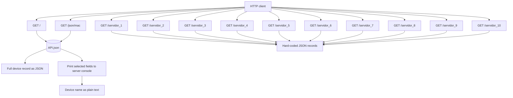

# Flask Network Device API

A small Flask application backed by `API.json`, which stores network-device records keyed by MAC address. The repository also contains Python exercises from class.

## Run the app

From the project root, install Flask if needed and start the development server:

```powershell
python -m pip install Flask
python app.py
```

The app runs with Flask debug mode enabled. `API.json` is loaded using a relative path, so start the command from the project root.

## Routes

All routes use `GET` (Flask also provides the corresponding `HEAD` and `OPTIONS` behavior).

| URL | Behavior | Response |
| --- | --- | --- |
| `/` | Reads the device record for MAC `1A:35:ED:0F:54:63` from `API.json`. | The complete device record, serialized as JSON by Flask. The current record is `R2`. |
| `/json/<mac>` | Looks up the record whose MAC address is supplied in the URL. Prints its `Name`, `Protocolos`, `status`, and `VLANs` values to the server console. | The device `Name` as plain text (for example, `/json/1A:35:ED:0F:54:63` returns `R2`). An unknown MAC currently raises a `KeyError` and results in a server error. |
| `/servidor_1` | Returns hard-coded record `0001` for a Router at `192.168.0.1`. | JSON with policy `Ro`, `Not Allowed`, weights `[0.2, 0.3, 0.5]`, and `status: true`. |
| `/servidor_2` | Returns hard-coded record `0002` for AP3, an Access Point at `192.168.36.122`. | JSON with policy `AP3`, `Not Allowed`, weights `[0.2, 0.3, 0.5]`, and `status: true`. |
| `/servidor_3` | Returns hard-coded record `0003` for GW4, a Gateway at `192.168.40.11`. | JSON with policy `GW4`, `Allowed`, weights `[0.2, 0.3, 0.5]`, and `status: true`. |
| `/servidor_4` | Returns hard-coded record `0004` for R5, a Router at `192.168.48.211`. | JSON with policy `R5`, `Allowed`, weights `[0.2, 0.3, 0.5]`, and `status: true`. |
| `/servidor_5` | Returns hard-coded record `0005` for FW6, a Firewall at `192.168.22.128`. | JSON with policy `FW6`, `Allowed`, weights `[0.2, 0.3, 0.5]`, and `status: true`. |
| `/servidor_6` | Returns hard-coded record `0006` for R7, a Router at `192.168.7.60`. | JSON with policy `R7`, `Allowed`, weights `[0.2, 0.3, 0.5]`, and `status: true`. |
| `/servidor_7` | Returns hard-coded record `0007` for SW8, a Switch at `192.168.38.16`. | JSON with policy `SW8`, `Not Allowed`, weights `[0.2, 0.3, 0.5]`, and `status: true`. |
| `/servidor_8` | Returns hard-coded record `0008` for GW9, a Gateway at `192.168.37.149`. | JSON with policy `GW9`, `Not Allowed`, weights `[0.2, 0.3, 0.5]`, and `status: true`. |
| `/servidor_9` | Returns hard-coded record `0009` for SW10, a Switch at `192.168.43.117`. | JSON with policy `SW10`, `Allowed`, weights `[0.2, 0.3, 0.5]`, and `status: true`. |
| `/servidor_10` | Returns hard-coded record `0010` for GW11, a Gateway at `192.168.24.243`. | JSON with policy `GW11`, `Not Allowed`, weights `[0.2, 0.3, 0.5]`, and `status: true`. |

The ten `/servidor_N` endpoints each return a one-record JSON object and do not read from `API.json`. Their device-type key is currently spelled `divice` in the response.

### Route map



## Data source

`API.json` is an object keyed by MAC address. Device records can contain a name, protocol list, status, and VLAN details. Each VLAN may include ports, policies, an IP address, and SSH/Ethernet flags. Field names and values reflect the current source data.

## Project files

| Path | Purpose |
| --- | --- |
| `app.py` | Flask application with two `API.json` routes and ten hard-coded server JSON routes. |
| `API.json` | Device records used by `/` and `/json/<mac>`. |
| `AC1`, `AC3.py`, `C1.py`, `C2.py`, `C3.py`, `C4.py`, `EjerciciosEnClase.py`, `ExamenCorrecto_U1.py` | Standalone class exercises; they are not registered as Flask routes. |

## Branch snapshot

The checked-out local branch is `feature/FlaskV01`. The supplied GitHub repository currently has branches `feature`, `fixes`, `main`, and `release1` through `release4`. This repository's inspected files do not define separate purposes for those branches. The requested push target is the remote branch `feature`.
