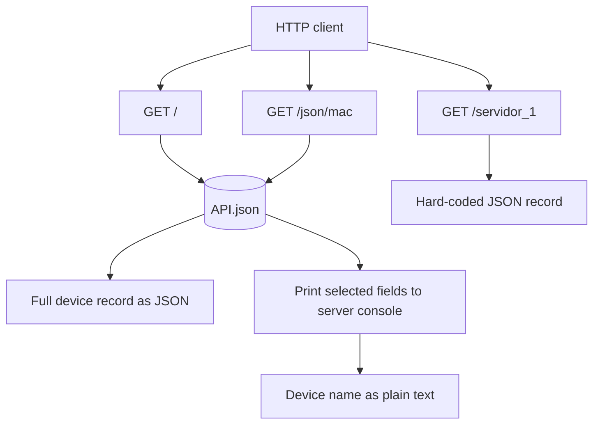

# Flask Network Device API

A small Flask application backed by `API.json`, which stores network-device records keyed by MAC address. The repository also contains Python exercises from class.

## Run the app

From the project root, install Flask if needed and start the development server:

```powershell
python -m pip install Flask
python app.py
```

The app runs with Flask debug mode enabled. `API.json` is loaded using a relative path, so start the command from the project root.

## Routes

All routes use `GET` (Flask also provides the corresponding `HEAD` and `OPTIONS` behavior).

| URL | Behavior | Response |
| --- | --- | --- |
| `/` | Reads the device record for MAC `1A:35:ED:0F:54:63` from `API.json`. | The complete device record, serialized as JSON by Flask. The current record is `R2`. |
| `/json/<mac>` | Looks up the record whose MAC address is supplied in the URL. Prints its `Name`, `Protocolos`, `status`, and `VLANs` values to the server console. | The device `Name` as plain text (for example, `/json/1A:35:ED:0F:54:63` returns `R2`). An unknown MAC currently raises a `KeyError` and results in a server error. |
| `/servidor_1` | Returns a hard-coded example device record; it does not read from `API.json`. | JSON containing device `0001`, IP `192.168.0.1`, policy data, and `status: true`. The response currently spells the device field as `divice`. |

### Route map



## Data source

`API.json` is an object keyed by MAC address. Device records can contain a name, protocol list, status, and VLAN details. Each VLAN may include ports, policies, an IP address, and SSH/Ethernet flags. Field names and values reflect the current source data.

## Project files

| Path | Purpose |
| --- | --- |
| `app.py` | Flask application and its three routes. |
| `API.json` | Device records used by `/` and `/json/<mac>`. |
| `AC1`, `AC3.py`, `C1.py`, `C2.py`, `C3.py`, `C4.py`, `EjerciciosEnClase.py`, `ExamenCorrecto_U1.py` | Standalone class exercises; they are not registered as Flask routes. |

## Branch snapshot

The checked-out local branch is `feature/FlaskV01`. The supplied GitHub repository currently has branches `feature`, `fixes`, `main`, and `release1` through `release4`. This repository's inspected files do not define separate purposes for those branches. The requested push target is the remote branch `feature`.
